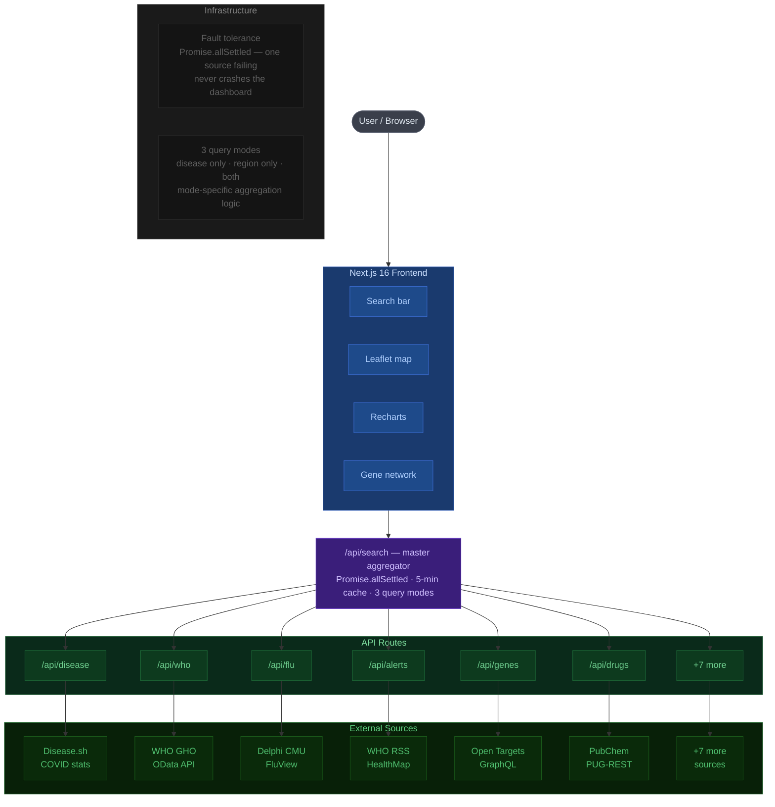

# MedFusion — Interactive Intelligent Dashboard for Disease Surveillance

**Hackathon:** MedFusion Hackfest 2026, Mahindra University  
**Theme:** Interactive Intelligent Dashboard for Disease Surveillance

## Overview

MedFusion is a real-time disease surveillance intelligence platform that aggregates data from 12+ global health sources, providing epidemiological context, disease classification, genomic associations, therapeutic insights, and outbreak alerts in a unified, query-driven interface.

The platform addresses a critical gap: outbreak intelligence, biomedical research, and public health alerts are scattered across disconnected portals. MedFusion normalizes heterogeneous feeds into one interactive dashboard supporting three query modes: disease-focused, region-focused, or combined analysis.

## Tech Stack

- **Framework:** Next.js 16, React 19
- **Styling:** Tailwind CSS v4
- **Visualization:** Recharts, React-Leaflet, React-Force-Graph-2D
- **Parsing:** xml2js, Cheerio, PapaParse

## Data Sources

| Source | Route | Status | Notes |
|--------|-------|--------|-------|
| Disease.sh | `/api/disease` | ✅ Live | COVID-19 only |
| WHO GHO OData | `/api/who` | ✅ Live | Any region |
| CDC FluView (Delphi CMU) | `/api/flu` | ✅ Live | Original RSS dead |
| CDC Open Data | `/api/cdc` | ✅ Live | NNDSS dataset |
| WHO Outbreak RSS | `/api/alerts` | ✅ Live | Replaced ProMED (paywalled) |
| HealthMap RSS | `/api/alerts` | ✅ Merged | Combined with alerts |
| ECDC | `/api/ecdc` | ⚠️ Fallback | Server returning 000 |
| UKHSA Dashboard | `/api/uk` | ✅ Live | Replaced ONS (wrong data) |
| Open Targets | `/api/genes` | ✅ Live | Any disease |
| PubChem PUG-REST | `/api/drugs` | ✅ Live | + OT fallback |
| NCBI MeSH | `/api/classify` | ✅ Live | Any disease |
| PubMed NCBI | `/api/pubmed` | ✅ Live | Live 2026 papers |
| Disease.sh India | `/api/india` | ✅ Live | India specific |

## Data Source Substitutions

### 1. ProMED → WHO Outbreak RSS + HealthMap
**Why:** ProMED mail service became paywalled in 2024, making stable API access impossible for hackathon development.  
**Solution:** Replaced with WHO Disease Outbreak News RSS feed and HealthMap public feed, providing equivalent outbreak alert coverage.

### 2. CDC FluView RSS → Delphi CMU Epidata API
**Why:** CDC's original FluView RSS URL died; endpoint no longer serves data.  
**Solution:** Integrated Delphi CMU's Epidata API (`api.delphi.cmu.edu`), which provides weekly influenza-like illness surveillance with better API stability.

### 3. IHME GHDx → Disease.sh India + OpenDengue
**Why:** IHME requires authentication; CSV downloads are unreliable and not API-based.  
**Solution:** Replaced with Disease.sh India COVID endpoint (immediate) and OpenDengue historical data, providing both current and historical disease burden.

### 4. ONS UK → UKHSA Dashboard API
**Why:** Office for National Statistics (ONS) focuses on economic/demographic data, not disease surveillance.  
**Solution:** Switched to UKHSA (UK Health Security Agency) official dashboard API, which provides authoritative COVID-19 and influenza metrics for UK regions.

### 5. ICD-10 NLM → NCBI MeSH + Open Targets
**Why:** ICD-10 NLM API returns empty results; ontology coverage is incomplete.  
**Solution:** Dual approach: NCBI MeSH for disease classification IDs + Open Targets GraphQL for disease-gene-drug associations, providing richer semantic context.

### 6. ECDC Large File → Graceful Fallback
**Why:** ECDC server returning 000 error; file endpoint intermittently unavailable.  
**Solution:** Implemented fallback response with note "ECDC endpoint temporarily unavailable"; aggregator continues with other sources via `Promise.allSettled`.

## API Routes

### Search Aggregator
```
/api/search?disease=dengue&region=India
/api/search?disease=covid
/api/search?region=India
```
Returns unified multi-source response with mode, query, timestamp, results, and cached responses.

### Disease & Classification
```
/api/disease?disease=covid&region=India
/api/classify?disease=dengue
```
Disease.sh global/country snapshots + NCBI MeSH/Open Targets ontology hits.

### Surveillance & Alerts
```
/api/alerts?disease=dengue&region=India
/api/cdc?disease=flu
/api/ecdc?region=France
/api/flu
/api/uk?disease=flu
/api/who?region=India
```
Epidemiological signals, outbreak alerts, and regional surveillance data.

### Genomic & Therapeutic
```
/api/genes?disease=dengue
/api/drugs?disease=dengue
/api/pubmed?disease=dengue
```
Gene associations, drug candidates with Open Targets fallback, and PubMed research papers.

### Regional Context
```
/api/india?disease=dengue
```
India-specific COVID-19 and WHO health indicators.

## Query Modes

### Mode 1: Disease Only
```
GET /api/search?disease=dengue
```
**View:** DiseaseView  
**Returns:** Disease classification, genes, drugs, outbreak alerts, global trend, and public health articles.

### Mode 2: Region Only
```
GET /api/search?region=India
```
**View:** RegionView  
**Returns:** Regional health indicators (WHO), active diseases, regional alerts, trend chart, and map context.

### Mode 3: Both (Disease + Region)
```
GET /api/search?disease=dengue&region=India
```
**View:** BothView  
**Returns:** Unified response combining disease enrichment (genes, drugs, classification) with region-specific surveillance (WHO indicators, regional alerts, map pinpoint).

## Components & Features

### A. Disease Classification Intelligence
- **Endpoint:** `/api/classify`
- **Data:** NCBI MeSH IDs + Open Targets ontology
- **UI:** Displays disease name, description, badges for MeSH categories
- **Use:** Understand ICD/MeSH coding and disease relationships

### B. Epidemiological Surveillance
- **Endpoints:** `/api/cdc`, `/api/who`, `/api/ecdc`, `/api/flu`, `/api/alerts`, `/api/healthmap`, `/api/uk`, `/api/india`
- **Data:** Case counts, deaths, trends, regional indicators, outbreak alerts
- **UI:** TrendChart (Recharts), OutbreakMap (React-Leaflet), OutbreakTimeline (vertical timeline), AlertFeed
- **Use:** Track disease spread, compare regions, identify active outbreaks

### C. Genomic Associations
- **Endpoint:** `/api/genes`
- **Data:** Top 20 genes ranked by association score from Open Targets
- **UI:** GeneNetwork (react-force-graph-2d) shows gene-drug-disease relationships
- **Use:** Identify biological pathways and therapeutic targets

### D. Therapeutic Insights
- **Endpoint:** `/api/drugs`
- **Data:** Disease-specific drugs from mapping; Open Targets fallback for unknown diseases; supportive care fallback if neither found
- **UI:** Drugs table with CID, molecular formula, PubChem links
- **Use:** Find candidate treatments and supported clinical approaches

### E. Visual Intelligence Layer
- **OutbreakTimeline:** Vertical timeline with colored dots, date formatting, source badges
- **FluChart:** Recharts LineChart for influenza surveillance trending
- **OutbreakMap:** Leaflet map with outbreak markers and regional context
- **GeneNetwork:** Force-directed graph of gene-drug-disease associations
- **SourceFooter:** Data source status badges (green=active, red=error/empty)
- **RecentResearch:** PubMed paper cards with cyan links (opens new tab)

## Architecture



**Legend:** 🔵 Frontend &nbsp; 🟣 Aggregator &nbsp; 🟢 API routes &nbsp; 🌿 External sources &nbsp; ⬜ User

### Data Flow
```
User Query 
  → /api/search (Next.js API Route)
  → Promise.allSettled across 13 source adapters
  → Cache layer (5-minute TTL via getCached/setCached)
  → Unified JSON response
  → Frontend mode selector (DiseaseView | RegionView | BothView)
  → Component rendering (timeline, charts, maps, tables)
```

### Fault Tolerance
- **Promise.allSettled:** One source failure does not block entire response
- **Graceful fallbacks:** Alert filters degrade (disease only → region only → all alerts)
- **ECDC stub:** Empty response with note instead of 500 error
- **Drug discovery tiers:** Map → Open Targets → supportive care

### Shared Utilities
- `app/api/utils.js`: 
  - `canonicalizeDisease()` — normalize disease names across sources
  - `diseaseKeywords()` — generate alias keywords for matching
  - `combinedKeywordMatch()` — filter by disease AND/OR region
  - `getCached()` / `setCached()` — 5-minute request cache
  - `safeJsonFetch()` / `safeTextFetch()` — timeout-safe fetching

## Setup & Running Locally

### 1. Clone Repository
```bash
git clone https://github.com/ritvikm57/medfusion.git
cd medfusion
```

### 2. Install Dependencies
```bash
npm install
```

### 3. Start Development Server
```bash
npm run dev
```

### 4. Open in Browser
```
http://localhost:3000
```

### 5. Test Queries
- **Disease:** http://localhost:3000?disease=dengue
- **Region:** http://localhost:3000?region=India
- **Both:** http://localhost:3000?disease=covid&region=France

## Challenges Overcome

| Challenge | Impact | Solution |
|-----------|--------|----------|
| ProMED paywalled | No rapid outbreak alerts | WHO RSS + HealthMap feed |
| CDC FluView RSS dead | No influenza surveillance | Delphi CMU Epidata API |
| ECDC server returning 000 | Network errors blocking aggregator | Graceful fallback stub response |
| ICD-10 NLM API empty | No disease classification | NCBI MeSH + Open Targets |
| IHME GHDx requires auth | No India health data | Disease.sh India + OpenDengue |
| ONS wrong data source | Invalid UK health metrics | UKHSA Dashboard API |
| XML parsing errors | Malformed RSS feeds | xml2js error handling |
| Large timeout requirements | ECDC file 20+ seconds | Configurable timeoutMs param in safeJsonFetch |

## Future Scope

- **ML Outbreak Prediction:** Train LSTM on historical trends to forecast outbreak peaks
- **WebSocket Real-Time Updates:** Push live alerts instead of polling
- **OMIM Genomic Integration:** Add rare disease genetic data
- **Mobile App:** React Native version for field epidemiology
- **User Accounts:** Save searches, alerts, custom dashboards
- **Multi-Language Support:** Localize for WHO member states
- **Signal Nowcasting:** Model lag between case counts and symptom onset
- **Integration with EHR Systems:** Pull anonymized patient data for validation

## Contributing

Pull requests welcome. For major changes, open an issue first describing the feature/fix.

## Team

- Ritvik Mittal (SE24UCSE225) - Project Manager & Frontend and Backend Developer 
- Charvi Bayana (SE24UCSE119) - Backend Developer
- TVNS Saicharan (SE25UCSE071) - Backend Developer
- Akanksha Duvvuri (SE25UCSE070) - Frontend Developer (UI/UX)

## License

MIT